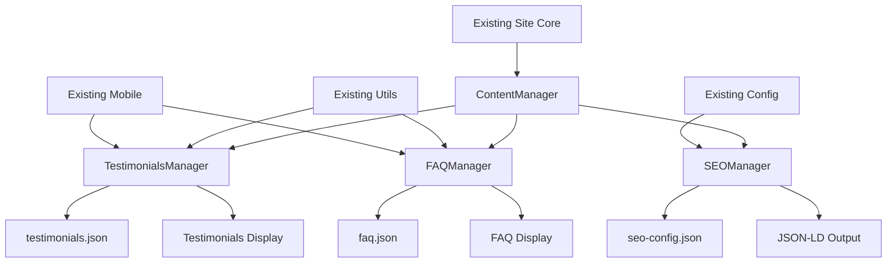

# MomNextDoor Brownfield Enhancement Architecture

## Introduction

This document outlines the architectural approach for enhancing MomNextDoor with Content & SEO Enhancement features. Its primary goal is to serve as the guiding architectural blueprint for AI-driven development of new features while ensuring seamless integration with the existing system.

**Relationship to Existing Architecture:**
This document supplements existing project architecture by defining how new components will integrate with current systems. Where conflicts arise between new and existing patterns, this document provides guidance on maintaining consistency while implementing enhancements.

### Existing Project Analysis

#### Current Project State
- **Primary Purpose:** Special needs care provider website for Edmonton families, focused on parent-to-parent authentic connection
- **Current Tech Stack:** Static HTML/CSS/JS with ES6 modules, mobile-first responsive design, GitHub Pages deployment
- **Architecture Style:** Modular component-based architecture with 9 JS modules and 7 CSS components
- **Deployment Method:** Git-based workflow with automated GitHub Pages deployment

#### Available Documentation
- Comprehensive README with development workflow
- Modular codebase with clear separation of concerns
- Existing performance optimizations documented
- Mobile-first design principles established
- Accessibility features documented

#### Identified Constraints
- Must maintain GitHub Pages compatibility (static site only)
- No server-side processing capability
- Must preserve existing mobile optimizations (header space saving)
- Must maintain current load performance
- Must preserve all existing accessibility features
- Limited to client-side JavaScript functionality

### Change Log
| Change | Date | Version | Description | Author |
|--------|------|---------|-------------|--------|
| Initial Architecture | 2025-09-25 | 1.0 | Complete brownfield enhancement architecture | Claude |

## Enhancement Scope and Integration Strategy

### Enhancement Overview
**Enhancement Type:** Content & SEO Enhancement
**Scope:** Local SEO optimization, testimonials system, enhanced content management, trust signals
**Integration Impact:** Low to Medium - primarily additive content features with minimal structural changes

### Integration Approach
**Code Integration Strategy:** Extend existing modular architecture by adding new modules following established patterns
**Database Integration:** JSON-based data files for testimonials and content management (no database required)
**API Integration:** Client-side integration with Google structured data and local SEO markup
**UI Integration:** Seamless integration with existing gradient design system and mobile-first responsive layout

### Compatibility Requirements
- **Existing API Compatibility:** N/A (no existing APIs)
- **Database Schema Compatibility:** JSON data structure following existing configuration patterns
- **UI/UX Consistency:** Must maintain existing gradient design, mobile header optimization, and accessibility standards
- **Performance Impact:** Zero degradation - must maintain or improve current load speeds

## Tech Stack

### Existing Technology Stack
| Category | Current Technology | Version | Usage in Enhancement | Notes |
|----------|-------------------|---------|---------------------|-------|
| Core HTML | HTML5 | Latest | Foundation for all enhancements | Semantic structure preserved |
| Styling | CSS3 with Custom Properties | ES2022 | Extended with new component styles | Maintain existing gradient system |
| JavaScript | ES6 Modules | ES2022 | New modules following existing patterns | 9 existing modules to extend |
| Build Process | None (Static) | N/A | Continue static approach | GitHub Pages compatible |
| Deployment | GitHub Pages | Latest | No changes required | Existing git workflow |
| Performance | Native lazy loading, optimized images | Native | Extend with new content optimization | Maintain current performance |

### New Technology Additions
| Technology | Version | Purpose | Rationale | Integration Method |
|------------|---------|---------|-----------|-------------------|
| JSON-LD | 1.1 | Structured data for SEO | Google recommended format | Static script tags in HTML |
| Intersection Observer API | Native | Lazy loading testimonials | Performance optimization | New JS module |

## Data Models and Schema Changes

### New Data Models

#### Testimonials Model
**Purpose:** Store and manage customer testimonials with metadata
**Integration:** JSON file following existing js/config.js pattern

**Key Attributes:**
- id: String - Unique identifier for each testimonial
- name: String - Customer name (with permission)
- location: String - General location (e.g., "North Edmonton")
- text: String - Testimonial content
- image: String - Photo filename (optional)
- date: String - Date of testimonial
- featured: Boolean - Whether to highlight in main rotation
- serviceType: String - Type of care provided

**Relationships:**
- **With Existing:** Integrates with existing site content structure
- **With New:** Links to FAQ categories and service descriptions

#### FAQ Model
**Purpose:** Structured FAQ content for better user experience and SEO
**Integration:** JSON structure for easy content management

**Key Attributes:**
- id: String - Unique FAQ identifier
- question: String - The question text
- answer: String - Detailed answer content
- category: String - Grouping category (e.g., "Services", "Rates")
- priority: Number - Display order priority
- keywords: Array - SEO-relevant keywords
- lastUpdated: String - Content freshness tracking

**Relationships:**
- **With Existing:** Links to existing service descriptions
- **With New:** References testimonials for social proof

### Schema Integration Strategy
**Database Changes Required:**
- **New Tables:** None (JSON file-based approach)
- **Modified Tables:** None (static site architecture)
- **New Files:** testimonials.json, faq.json, seo-config.json
- **Migration Strategy:** Git-based deployment with content files

**Backward Compatibility:**
- All existing functionality preserved without modification
- New content loaded asynchronously to prevent blocking existing features

## Component Architecture

### New Components

#### TestimonialsManager Component
**Responsibility:** Load, display, and rotate customer testimonials
**Integration Points:** Integrates with existing DOM manipulation patterns

**Key Interfaces:**
- loadTestimonials() - Fetch testimonials from JSON
- displayTestimonials(container) - Render testimonials in specified container
- rotateTestimonials() - Handle automatic rotation

**Dependencies:**
- **Existing Components:** utils.js for DOM helpers, responsive.js for mobile layout
- **New Components:** SEOManager for structured data integration

**Technology Stack:** ES6 modules, Intersection Observer API, CSS Grid/Flexbox

#### FAQManager Component
**Responsibility:** Load and display expandable FAQ sections
**Integration Points:** Follows existing interactive component patterns

**Key Interfaces:**
- loadFAQ() - Load FAQ data from JSON
- renderFAQ(container) - Create expandable FAQ interface
- toggleFAQ(id) - Handle expand/collapse functionality

**Dependencies:**
- **Existing Components:** utils.js, mobile.js for touch interactions
- **New Components:** SEOManager for FAQ structured data

**Technology Stack:** ES6 modules, CSS transitions, accessibility features

#### SEOManager Component
**Responsibility:** Handle structured data, meta tags, and SEO optimization
**Integration Points:** Extends existing head management patterns

**Key Interfaces:**
- injectStructuredData() - Add JSON-LD markup
- updateMetaTags() - Dynamic meta tag management
- generateSitemap() - Create XML sitemap structure

**Dependencies:**
- **Existing Components:** config.js for site configuration
- **New Components:** TestimonialsManager, FAQManager for content data

**Technology Stack:** JSON-LD, Open Graph, Twitter Cards

#### ContentManager Component
**Responsibility:** Centralized content loading and management
**Integration Points:** Follows existing configuration-driven approach

**Key Interfaces:**
- loadContent(type) - Generic content loader
- updateContent(type, data) - Content update interface
- validateContent(data) - Content validation

**Dependencies:**
- **Existing Components:** All existing modules for consistent integration
- **New Components:** All new content components

**Technology Stack:** ES6 modules, JSON validation, error handling

### Component Interaction Diagram


## Source Tree

### Existing Project Structure
```
momnextdoor-website/
├── index.html
├── css/
│   ├── base.css
│   ├── header.css
│   ├── main.css
│   ├── responsive.css
│   ├── footer.css
│   ├── animations.css
│   └── utilities.css
├── js/
│   ├── config.js
│   ├── utils.js
│   ├── mobile.js
│   ├── header.js
│   ├── main.js
│   ├── footer.js
│   ├── animations.js
│   ├── accessibility.js
│   └── app.js
├── images/
└── docs/
```

### New File Organization
```
momnextdoor-website/
├── index.html                     # Enhanced with new sections
├── css/
│   ├── [existing files preserved]
│   ├── testimonials.css           # New testimonials styling
│   ├── faq.css                    # New FAQ styling
│   └── seo-enhancements.css       # New SEO-related styling
├── js/
│   ├── [existing files preserved]
│   ├── content/                   # New content management folder
│   │   ├── testimonials-manager.js
│   │   ├── faq-manager.js
│   │   ├── seo-manager.js
│   │   └── content-manager.js
│   └── app.js                     # Updated with new component imports
├── data/                          # New content data folder
│   ├── testimonials.json
│   ├── faq.json
│   └── seo-config.json
├── images/
│   └── testimonials/              # New testimonial photos folder
└── docs/
    └── architecture.md            # This document
```

### Integration Guidelines
- **File Naming:** Continue kebab-case naming convention (testimonials-manager.js)
- **Folder Organization:** Group related functionality (js/content/ for new content modules)
- **Import/Export Patterns:** Use existing ES6 module patterns with explicit imports/exports

## Infrastructure and Deployment Integration

### Existing Infrastructure
**Current Deployment:** GitHub Pages with automatic deployment on main branch push
**Infrastructure Tools:** Git-based workflow, GitHub Actions (implicit)
**Environments:** Single production environment (GitHub Pages)

### Enhancement Deployment Strategy
**Deployment Approach:** Incremental deployment using existing git workflow
**Infrastructure Changes:** None required - fully compatible with GitHub Pages
**Pipeline Integration:** Leverages existing automatic deployment on push to main

### Rollback Strategy
**Rollback Method:** Git revert to previous commit, automatic redeployment
**Risk Mitigation:** Feature flags in config.js for gradual rollout
**Monitoring:** Client-side error tracking and performance monitoring

## Coding Standards

### Existing Standards Compliance
**Code Style:** ES6+ with consistent formatting, semicolons, camelCase variables
**Linting Rules:** No formal linting currently - will maintain existing style consistency
**Testing Patterns:** No formal testing framework - manual testing approach
**Documentation Style:** Inline comments and README documentation

### Enhancement-Specific Standards
- **SEO Content Standards:** All content must be accessible and semantically structured
- **Performance Standards:** New features must not impact Core Web Vitals
- **Accessibility Standards:** WCAG 2.1 AA compliance for all new interactive elements
- **JSON Schema Standards:** All data files must follow defined schema structure

### Critical Integration Rules
- **Existing API Compatibility:** N/A - no existing APIs to maintain
- **Content Integration:** All new content must be JSON-based for easy management
- **Error Handling:** Graceful degradation if content fails to load
- **Logging Consistency:** Use console.error for debugging, console.info for status

## Testing Strategy

### Integration with Existing Tests
**Existing Test Framework:** Manual testing approach with no formal automated testing
**Test Organization:** Component-level manual testing with browser verification
**Coverage Requirements:** Full functionality testing across mobile and desktop

### New Testing Requirements

#### Unit Tests for New Components
- **Framework:** Manual testing approach (maintaining consistency)
- **Location:** Browser console testing and validation
- **Coverage Target:** All new component public methods
- **Integration with Existing:** Follow established manual testing procedures

#### Integration Tests
- **Scope:** Verify new components integrate properly with existing functionality
- **Existing System Verification:** Ensure all current features remain functional
- **New Feature Testing:** Testimonials display, FAQ interaction, SEO markup validation

#### Regression Testing
- **Existing Feature Verification:** Click-to-call, business hours, mobile navigation, accessibility
- **Automated Regression Suite:** None currently - maintain manual approach
- **Manual Testing Requirements:** Cross-browser testing on mobile and desktop devices

## Security Integration

### Existing Security Measures
**Authentication:** None required (public informational site)
**Authorization:** None required (static content)
**Data Protection:** No sensitive data collection or storage
**Security Tools:** GitHub's built-in security scanning

### Enhancement Security Requirements
**New Security Measures:** Input validation for content management, image optimization security
**Integration Points:** Secure handling of testimonial images and content
**Compliance Requirements:** GDPR-friendly testimonial consent process

### Security Testing
**Existing Security Tests:** None formal - static site security model
**New Security Test Requirements:** Content injection prevention, image security validation
**Penetration Testing:** Not required for static content enhancement

## Next Steps

### Story Manager Handoff

**Prompt for Story Manager:**
"Create implementation stories for the MomNextDoor Content & SEO Enhancement based on the completed brownfield architecture document at `/docs/architecture.md`. Key integration requirements validated:

- Static HTML/CSS/JS architecture with ES6 modules must be preserved
- GitHub Pages deployment compatibility required
- Existing mobile optimizations and performance cannot be degraded
- All 9 existing JS modules and 7 CSS components must remain functional
- New content management via JSON files following existing config.js patterns

First story should implement the SEO Manager component with structured data markup, ensuring integration with existing head management approaches. Include checkpoints to verify existing functionality remains intact after each component addition.

Constraint: Must maintain existing mobile-first responsive design and accessibility features throughout implementation."

### Developer Handoff

**Prompt for Developers:**
"Begin implementing the MomNextDoor Content & SEO Enhancement using the brownfield architecture document at `/docs/architecture.md`.

**Critical Integration Requirements:**
- Follow existing ES6 module patterns established in js/ directory
- Maintain existing CSS custom properties and gradient design system
- Preserve all current mobile optimizations (especially header space efficiency)
- New components must load asynchronously to prevent blocking existing features
- Use established DOM manipulation patterns from utils.js

**Technical Decisions Validated:**
- JSON-based content management following js/config.js patterns
- Component-based architecture with 4 new modules: ContentManager, TestimonialsManager, FAQManager, SEOManager
- CSS integration maintaining existing responsive breakpoints and accessibility

**Implementation Sequence for Risk Minimization:**
1. SEO Manager (lowest risk - metadata only)
2. Content Manager (foundation for other components)
3. FAQ Manager (self-contained functionality)
4. Testimonials Manager (most visible feature - implement last)

**Verification Steps:** After each component, verify click-to-call, business hours display, mobile navigation, and accessibility features remain fully functional."

---

**Architecture Document Status:** Complete and Ready for Implementation
**Next Phase:** Story breakdown and iterative development with continuous integration testing